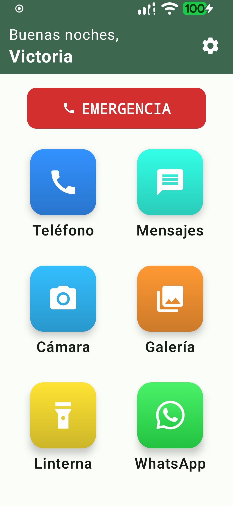
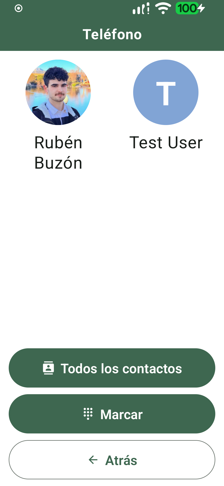
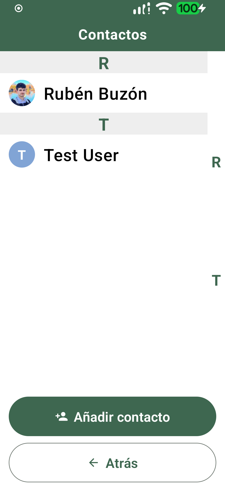
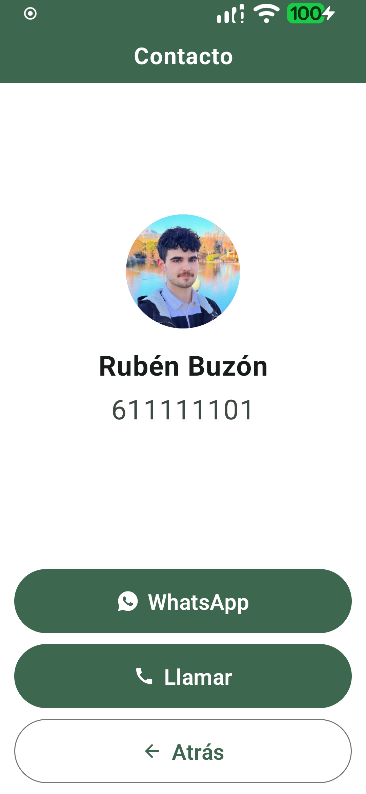
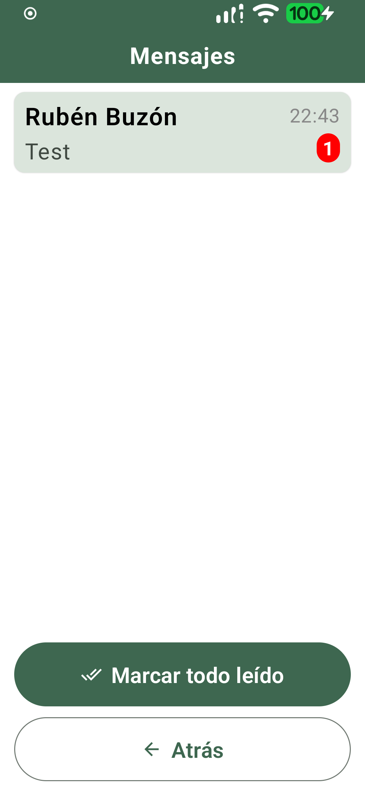
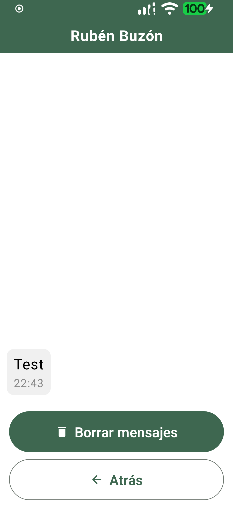
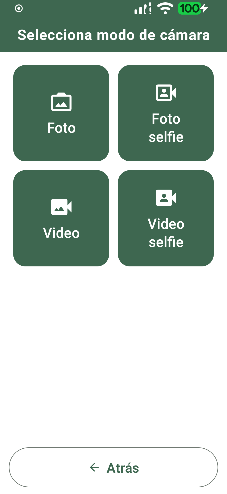
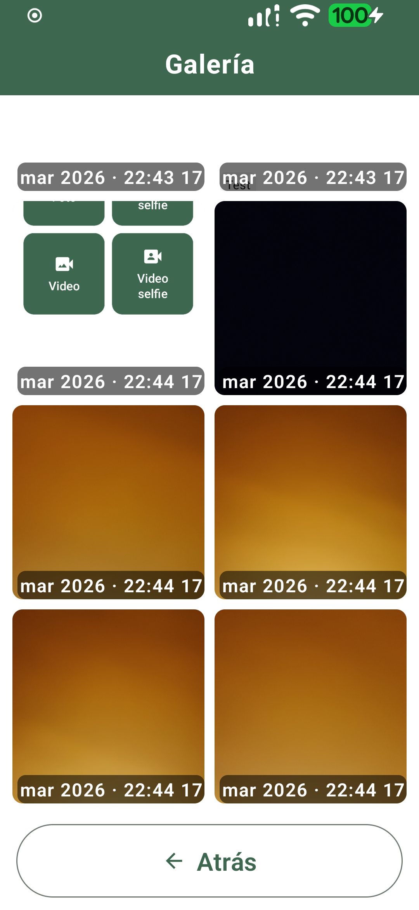
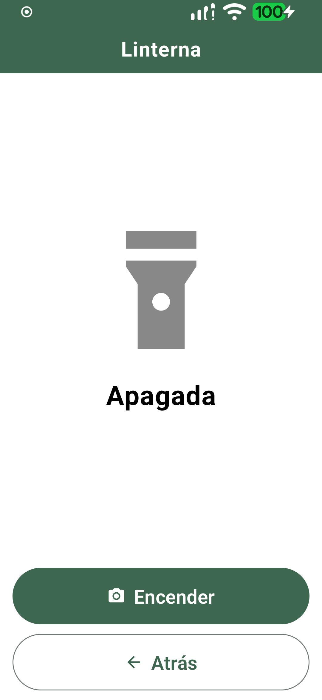

# Senior Launcher

Senior Launcher is an Android launcher app designed for older users, with a simplified interface, visual accessibility, and optional remote control through a backend.

It is ideated as an Android-first experience inspired by the iPhone Guided Access mode, focused on reducing distractions and making daily use easier for seniors.

## What it is

- Main Android launcher with simple navigation.
- Includes built-in mini apps: phone, SMS, camera, gallery, and flashlight.
- Lets you choose and sort allowed apps shown on the home screen.
- Can optionally sync with a backend for real-time remote control.

## Screenshots

| Home | Phone - Favorites | Phone - Contacts |
|---|---|---|
|  |  |  |

| Phone - Contact detail | Messages - List | Messages - Thread |
|---|---|---|
|  |  |  |

| Camera | Gallery | Flashlight |
|---|---|---|
|  |  |  |

## How it works

The app keeps local state (preferences, app order, internal modes) and, when sync is enabled, opens a WebSocket connection to the backend to:

- Send device state.
- Receive config changes.
- Receive remote actions (e.g. place a call or create a contact).

## Requirements

- API 26 or higher.
- Device permissions depending on features used (contacts, SMS, camera, gallery, calls).

## Installation and run

### Android app

1. Open the project in Android Studio.
2. Sync Gradle.
3. Run on a physical device or emulator.

### Set as launcher

1. Install the app.
2. Press the system Home button.
3. Select Senior Launcher and set it as default.

## Backend configuration in the app

In Senior Launcher settings:

- Enable backend sync.
- `Server URL` (example: `http://192.168.1.10:8080`).
- Unique device `Device ID`.
- Optional `API Token`.

Notes:

- Do not use `0.0.0.0` as host on Android.
- Use an IP/domain reachable by the device.

## Backend

The backend lives in `backend/` and includes a web control panel.

Quick start:

```bash
cd backend
bun install
bun run start
```

Web panel:

- `http://localhost:8080/`

Detailed backend docs:

- `backend/README.md`

## Project structure

- `app/`: Android application.
- `backend/`: Bun backend + WebSocket + web panel.
- `app/src/main/java/com/seniorlauncher/app/MainActivity.kt`: main flow and backend sync.

## Sync state model

Sync uses the `device` model:

- Web panel: `role=web`
- Android app: `role=device`

Backend persists state and command queues in `backend/device-sync-store.json`.

## Disclaimer

This project has been created with AI assistance for parts of the design, implementation, and documentation. I'm not an Android developer and this app is for personal use, so I used AI to help fill in gaps in my knowledge and speed up development. If you find any issues or have suggestions, feel free to open an issue or PR.
